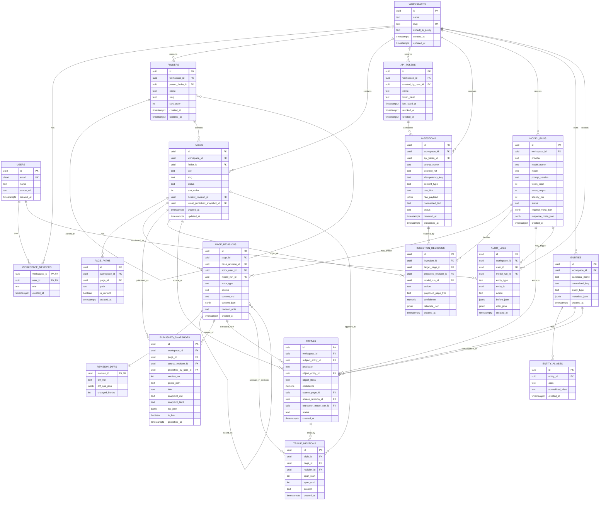

# ERD 초안 — AI 기반 Markdown 지식 위키 서비스

> **문서 위치:** 본 ERD는 [`docs/`](.) 산하 데이터 모델 기준 문서다. 백로그 [`TASKS.md`](TASKS.md), PRD [`PRD — ...md`](PRD%20%E2%80%94%20AI%20%EB%B3%B4%EC%A1%B0%20Markdown%20%EC%A7%80%EC%8B%9D%20%EC%9C%84%ED%82%A4%EB%AC%B8%EC%84%9C%20%EC%84%9C%EB%B9%84%EC%8A%A4.md), 오케스트레이터 가이드 루트 [`AGENTS.md`](../AGENTS.md) / [`CLAUDE.md`](../CLAUDE.md) 참고.
>
> **예정된 스키마 추가 (2026-04-29 RFC):** Ingestion Agent 도입에 따라 다음 변경이 있다 — (a) 신규 `agent_runs` 테이블 (`ingestion_id`, `workspace_id`, `status`, `plan_json`, `steps_json`, `decisions_count`, `total_tokens`, ...), (b) `model_runs` / `ingestion_decisions`에 nullable `agent_run_id` FK 추가, (c) `workspaces`에 `ingestion_mode TEXT NOT NULL DEFAULT 'classic'` 컬럼 추가. 모두 NULL fallback이라 기존 classic classifier 행과 공존. 상세는 [`ingestion-agent-plan.md`](ingestion-agent-plan.md) §"Schema 변경" 절. 마이그레이션 번호는 `0015_agent_runs.sql` 예정.

## 1. 설계 원칙

이 ERD는 아래 원칙으로 설계했습니다.

* **문서의 정본은 Markdown**
* **모든 수정은 revision 단위로 추적**
* **AI/사용자/외부 API 입력 모두 동일한 revision/audit 체계로 관리**
* **triple은 Graph DB 없이 PostgreSQL에 provenance 포함 저장**
* **publish는 draft와 분리된 snapshot 기반**
* **경로(path) 변경 이력까지 추적 가능하도록 page_paths 분리**

---

## 2. 핵심 엔티티 목록

### 문서/편집 계층

* `users`
* `workspaces`
* `workspace_members`
* `folders`
* `pages`
* `page_paths`
* `page_revisions`
* `revision_diffs`
* `published_snapshots`

### 외부 AI 수신 / 의사결정 계층

* `api_tokens`
* `ingestions`
* `ingestion_decisions`
* `model_runs`

### 지식 그래프 계층

* `entities`
* `entity_aliases`
* `triples`
* `triple_mentions`

### 감사/로그 계층

* `audit_logs`

---

## 3. Core ERD (Mermaid)

아래 ERD는 바로 문서에 붙일 수 있는 형태입니다.



---

## 4. 테이블별 역할 설명

## 4.1 `pages`

문서의 메타 엔티티입니다.
실제 본문은 여기 저장하지 않고, 현재 어떤 revision이 최신인지 가리키는 역할을 합니다.

핵심 포인트:

* 문서 상태: `draft`, `published`, `archived`
* 현재 편집본 참조: `current_revision_id`
* 현재 공개본 참조: `latest_published_snapshot_id`

---

## 4.2 `page_revisions`

문서의 모든 변경 이력을 저장하는 핵심 테이블입니다.

권장 필드 의미:

* `base_revision_id`: 어떤 revision을 기준으로 수정했는지
* `actor_type`: `user`, `ai`, `system`
* `actor_user_id`: 사용자 수정이면 사용자 ID
* `model_run_id`: AI 수정이면 해당 모델 실행 ID
* `source`: `editor`, `ingest_api`, `rollback`, `publish`

즉, **사용자 수정과 AI 수정을 같은 구조로 관리**할 수 있게 됩니다.

---

## 4.3 `revision_diffs`

revision 자체는 전체 본문 snapshot을 저장하고, diff는 별도 테이블에 둡니다.

이렇게 분리하는 이유:

* 본문 조회는 빠르게
* diff 렌더링은 필요할 때만
* line diff와 block diff 둘 다 저장 가능

권장:

* `diff_md`: markdown line diff
* `diff_ops_json`: block/structured op diff

---

## 4.4 `published_snapshots`

draft와 public 노출본을 분리하는 테이블입니다.

핵심:

* publish는 revision을 그대로 노출하는 게 아니라 **snapshot 생성**
* 특정 시점의 문서를 외부 URL로 안정적으로 제공
* rollback / republish가 쉬움

---

## 4.5 `ingestions`

외부 AI나 외부 시스템이 POST API로 보낸 원본 입력 저장소입니다.

중요한 이유:

* 외부 입력 원문을 유실 없이 저장
* AI 판단 실패 시 재처리 가능
* idempotency key 중복 방지 가능

---

## 4.6 `ingestion_decisions`

외부 입력을 시스템이 어떻게 처리했는지 저장합니다.

예:

* `create`
* `update`
* `append`
* `noop`
* `needs_review`

이 테이블이 있어야 “왜 새 페이지를 만들었는지”, “왜 기존 페이지를 수정했는지” 추적이 가능합니다.

---

## 4.7 `entities`, `entity_aliases`, `triples`, `triple_mentions`

Graph DB 없이 graph 패널을 만들기 위한 핵심 구조입니다.

### `entities`

정규화된 노드

### `entity_aliases`

동일 엔티티의 별칭

* 예: `GPT-5.4`, `gpt 5.4`, `GPT5.4`

### `triples`

지식 관계 저장

* `(subject) -[predicate]-> (object)`
* object는 entity 또는 literal 가능

### `triple_mentions`

문서의 어느 부분에서 이 triple이 나왔는지 span 수준으로 연결

이 구조 덕분에 우측 패널에서

* 현재 문서 관련 node
* 연결 관계
* triple 출처 문장
  을 같이 보여줄 수 있습니다.

---

## 4.8 `model_runs`

AI 호출을 추적하는 테이블입니다.

반드시 남겨야 할 것:

* provider
* model_name
* reasoning/thinking mode
* prompt version
* token usage
* latency
* success/failure

이게 있어야 나중에

* 비용 추적
* 품질 비교
* 모델 교체
* 문제 재현
  이 가능합니다.

---

## 4.9 `audit_logs`

감사 로그 테이블입니다.

권장 기록 대상:

* 페이지 생성/삭제/이동
* 폴더 이동
* publish/unpublish
* API token 생성/폐기
* AI 자동 반영
* rollback

---

# 5. 핵심 관계 해석

## A. 문서 편집 흐름

`pages`
→ `page_revisions`
→ `revision_diffs`

즉, 페이지는 문서 그 자체가 아니라 **revision들의 컨테이너**입니다.

---

## B. publish 흐름

`page_revisions`
→ `published_snapshots`

즉, 게시 시점에는 revision에서 snapshot을 떠서 외부 공개용 문서를 만듭니다.

---

## C. 외부 AI 입력 흐름

`api_tokens`
→ `ingestions`
→ `ingestion_decisions`
→ `pages` / `page_revisions`

즉, POST API 입력은 무조건 원문 저장 후, 분석과 반영이 뒤따릅니다.

---

## D. graph 생성 흐름

`page_revisions`
→ `triples`
→ `triple_mentions`
→ `entities`

즉, graph는 문서에서 추출된 구조화 지식의 결과물입니다.

---

# 6. 반드시 넣어야 할 제약조건

아래는 구현에서 매우 중요합니다.

## 6.1 `triples` 제약

`object_entity_id` 와 `object_literal` 은 **정확히 하나만 값이 있어야 함**

예시:

* entity-object triple: `A -> uses -> B`
* literal-object triple: `A -> created_at -> "2026-04-14"`

체크 제약 권장:

```sql
CHECK (
  (object_entity_id IS NOT NULL AND object_literal IS NULL)
  OR
  (object_entity_id IS NULL AND object_literal IS NOT NULL)
)
```

---

## 6.2 `page_paths`

한 페이지는 path 변경 이력이 남아야 하지만, 현재 path는 하나여야 합니다.

권장:

* `UNIQUE (workspace_id, path)` where `is_current = true`
* 페이지당 current path 1개만 허용

---

## 6.3 `ingestions`

동일 외부 이벤트 중복 반영 방지

권장:

```sql
UNIQUE (workspace_id, idempotency_key)
```

---

## 6.4 `folders`

같은 부모 폴더 아래 slug 중복 금지

권장:

```sql
UNIQUE (workspace_id, parent_folder_id, slug)
```

---

## 6.5 `pages`

같은 폴더 아래 slug 중복 금지

권장:

```sql
UNIQUE (workspace_id, folder_id, slug)
```

---

## 6.6 `published_snapshots`

한 페이지에 live snapshot은 하나만 유지

권장:

* `is_live = true` 인 row는 page당 1개만 허용

---

# 7. 추천 인덱스

운영 성능상 거의 필수입니다.

```sql
-- 페이지 탐색
INDEX pages_workspace_folder_idx (workspace_id, folder_id, sort_order);

-- revision 조회
INDEX page_revisions_page_created_idx (page_id, created_at DESC);

-- ingestion 재처리/대기열
INDEX ingestions_workspace_status_idx (workspace_id, status, received_at DESC);

-- decision 조회
INDEX ingestion_decisions_ingestion_idx (ingestion_id, created_at DESC);

-- entity 정규화
UNIQUE INDEX entities_workspace_normalized_key_uk (workspace_id, normalized_key);

-- triple 그래프 탐색
INDEX triples_workspace_subject_idx (workspace_id, subject_entity_id);
INDEX triples_workspace_object_idx (workspace_id, object_entity_id);
INDEX triples_source_page_idx (source_page_id);
INDEX triples_source_revision_idx (source_revision_id);

-- triple mention span 조회
INDEX triple_mentions_triple_idx (triple_id);
INDEX triple_mentions_revision_idx (revision_id);

-- audit 추적
INDEX audit_logs_workspace_created_idx (workspace_id, created_at DESC);

-- path lookup
UNIQUE INDEX page_paths_current_path_uk (workspace_id, path) WHERE is_current = true;
```

---

# 8. 구현 시 추천 타입/규칙

* PK: `uuid`
* 시간: `timestamptz`
* 자유 메타데이터: `jsonb`
* 이메일: `citext`
* enum은 초기엔 PostgreSQL enum보다 **check constraint + text**가 변경에 유연
* 삭제는 hard delete보다 `deleted_at` 기반 soft delete를 우선 고려

---

# 9. MVP에 추가하면 좋은 확장 테이블

아래는 Core에는 안 넣었지만 실제 제품에서는 거의 유용합니다.

## 9.1 `page_links`

문서 간 내부 링크를 triple과 별도로 저장

용도:

* related pages
* backlink
* 문서 네비게이션 강화

예시 필드:

* `source_page_id`
* `target_page_id`
* `source_revision_id`
* `anchor_text`
* `link_type`

---

## 9.2 `review_items`

AI 판단이 애매한 경우 사람이 승인하는 큐

용도:

* `needs_review`
* 자동 수정 승인/거절
* 운영자 inbox

예시 필드:

* `workspace_id`
* `source_type`
* `source_id`
* `target_page_id`
* `proposed_revision_id`
* `status`
* `assigned_user_id`

---

## 9.3 `assets`

이미지/파일 업로드 관리

용도:

* 에디터 이미지 블록
* 첨부 문서
* publish 시 정적 asset 연결

---

## 9.4 `search_documents`

검색 최적화를 위한 denormalized read model

용도:

* title/body/entity 통합 검색
* FTS, trigram, semantic indexing 전개

---

# 10. 가장 중요한 설계 포인트 5개

## 1) `pages`와 `page_revisions`를 분리

문서 현재 상태와 변경 이력을 분리해야 AI 자동 수정이 안전합니다.

## 2) `published_snapshots` 분리

draft와 public을 분리해야 GitBook처럼 안정적인 게시가 가능합니다.

## 3) `ingestions` 원문 저장

외부 AI 입력은 실패하더라도 반드시 재처리 가능해야 합니다.

## 4) `triples`에 provenance 저장

단순 triple 저장만 하면 나중에 신뢰도와 출처 추적이 안 됩니다.

## 5) `model_runs` 독립 관리

모델 교체, 품질 추적, 비용 분석을 위해 필수입니다.

---

# 11. 이 ERD 기준 권장 구현 순서

1. `users`, `workspaces`, `workspace_members`
2. `folders`, `pages`, `page_paths`
3. `page_revisions`, `revision_diffs`
4. `published_snapshots`
5. `api_tokens`, `ingestions`, `ingestion_decisions`
6. `model_runs`
7. `entities`, `entity_aliases`, `triples`, `triple_mentions`
8. `audit_logs`
9. 이후 `review_items`, `page_links`, `assets`, `search_documents`

---

# 12. 한 줄 결론

이 서비스의 DB 핵심은 **“페이지”가 아니라 “revision + snapshot + triple provenance”** 입니다.
이 구조로 가면 사람 편집, AI 자동 수정, 외부 API 입력, publish, graph 탐색이 한 DB 안에서 자연스럽게 연결됩니다.


